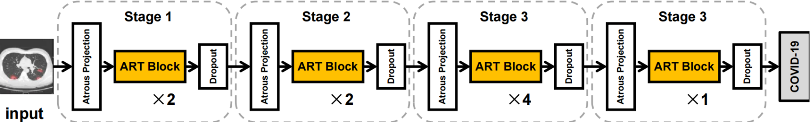
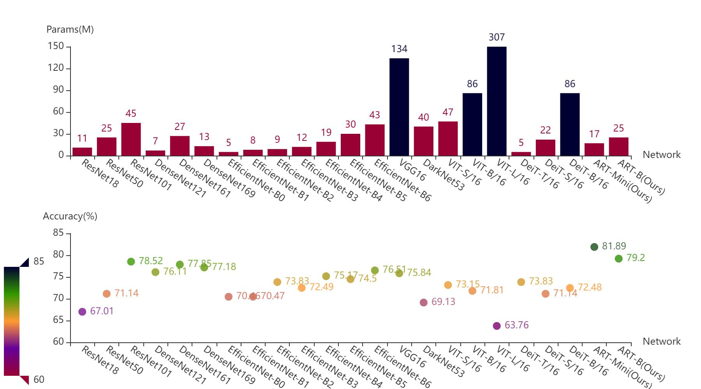
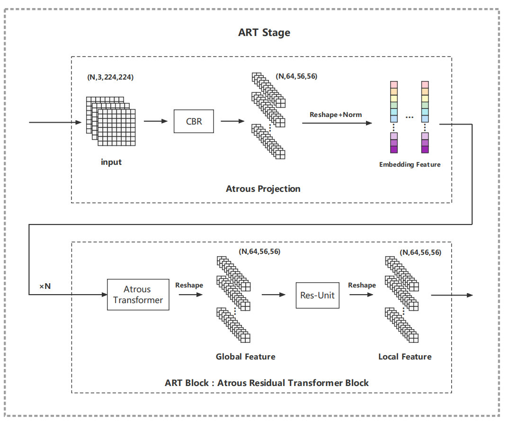

# Atrous Residual Transformer (ART)
Welcome to ART, this is the official implementation of our latest research work, ART, which has been accepted by IEEE International Conference on Multimedia and Expo 2023, Brisbane, Australia July 10 to 14, 2023.
   


# ART Research Background
Convolutional neural networks (CNNs) have achieved great success in medical image processing.
However, recent studies have shown that the CNNs lack the ability to capture global features due to the problem of inherent local receptive field.
With the intrinsic long-range global dependency information, transformer neural networks have become the alternative architectures of CNNs.
The current transformer models suffer from heavy parameters, which need the large-scale datasets, such as ImageNet and huge computing power for training. Transformers rely on a bunch of complex data augmentations and tedious transfer learning strategies. Transformers are very sensitive to hyper parameters and also suffer from insufficient ability to extract local features, which is a tragedy for few-shot datasets, especially the medical image datasets.

#### Overview of ART Pipeline
<div width="500" align="center">
  
</div>


# ART Introduction
- To address these problems, in this work, we innovatively propose an Atrous Residual Transformer (ART) , a cascade architecture of four ART Stages, which is more lightweight and suitable for medical image processing effectively. 
- We propose an Atrous Projection module to replace the previous Linear Projection to efficiently generate embedding features, and Atrous Transformer layer to learn global information and local features, while greatly reducing the amount of model parameters (Params) and floating-point operations (FLOPs).

- We conduct rich experiments with ART, demonstrating that this method achieves remarkable performances comparing with the state-of-the-art CNNs and mainstream transformers, with lower FLOPs and fewer parameters. 
Our ART model training on COVID-CT dataset from scratch, achieves 81\% accuracy surpassing ResNet50 by 10\%, EfficientNet-B6 by 5\% and ViT-B by 9\%, DeiT-B by 9\% respectively, and it only has 17M Params and 2.9FLOPs. 
Meanwhile, to verify the robustness of the ART algorithm on other modal medical images, we train it on COVID-Xray dataset and ART also performs its superiority and merits outperforming ResNet50 by 4\%, ViT-B by 20\%, Dei-T by 12\% respectively.

#### Overview of ART Results
<div width="500" align="center">
  
</div>


#### Overview of ART
<div width="1000" align="center">
  
</div>


# ART Usage
### Atrous Residual Transformer code wiki

### requirements
- PaddlePaddle >=2.0
- Python>=3.6
- Numpy
- Pandas
- Matplotlib
- Opencv>=3.4

### Backbones
- convolutionalTransformer.py
- densenet.py
- distilled_vision_transformer.py
- efficientnet.py
- resnet_.py
- VGG.py
- vision_transformer.py

### ART.py
- This file is the networking code for the ART neural network model. Directly running ART.py can print the network structure of the ART model


### dataset
- The COVID-CT and COVID-Xray datasets required for the experiment are all open-source medical imaging datasets, 
and you can also replace them with your own datasets.

### out
- The folder where the model saves weights

### data_test.py
- Running this code can test whether the dataset was successfully loaded and visualize the dataset samples

### dataloader.py
- This code is the data loader for ART. Please note that you need to specify the directory where the data will be loaded

### mean_std.py
- Prepare for normalization by analyzing the mean and variance of the dataset samples

### train_ART.py
- This code is the training code for ART, which is relatively concise and has multiple built-in comparison models. 
It can be switched freely based on annotations.

### evaluation matrix
- The evaluation indicators are acc, FLOPS, Params


## Citation ART

```
@misc{ppdet2019,
title={An Efficient Transformer with Atrous Residual Learning for Medical Images},
author={ART Authors},
booktitle={IEEE International Conference on Multimedia and Expo 2023n (ICME)},
year={2023}
}
```

## Contributing
At present, the ART algorithm performs better as a backbone in medical image classification tasks compared to CNN and Transformer. The next research work can use ART to explore high-level visual tasks as a starting point, or explore medical detection or segmentation networks.


## Q&A
Welcome researchers interested in the field of medical artificial intelligence to exchange ideas.